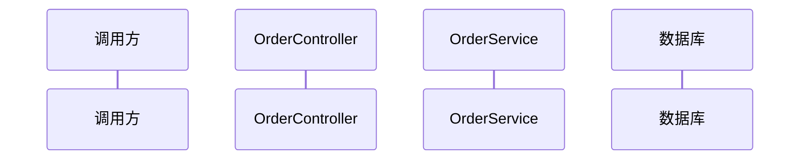
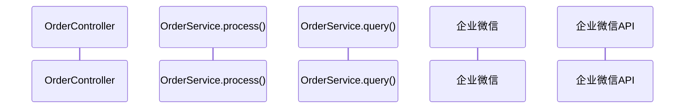
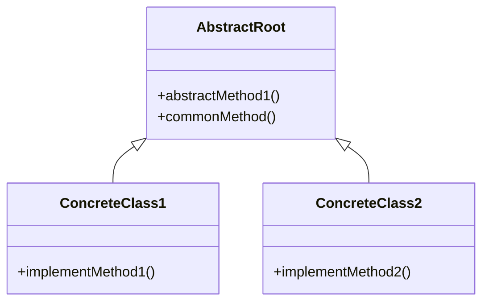

你运行的是 Java 方法业务流程分析 Pipeline。梳理Java任意类方法的完整业务调用堆栈，分析设计模式和体系结构，生成包含调用堆栈、体系结构、Mermaid时序图的分析文档。还可以提供重构建议，整理代码改善点。**执行每个步骤依次进行，禁止跳过步骤。**

## 触发场景

当用户说：
- "梳理这个方法的完整调用流程"
- "分析这个controller方法的业务逻辑"
- "分析这个service方法的调用链"
- "帮我生成方法调用堆栈和时序图"
- "参照文档分析这两个类中的方法，得到完整调用堆栈"
- "生成XX业务分析文档放在根目录的docs目录下"
- "补充重构建议，表格形式整理提炼函数/提炼变量"

这些场景都应该触发这个skill。

## Step 1 — 信息收集与确认
**DO NOT PROCEED TO STEP 2 UNTIL ALL INFORMATION IS CONFIRMED**

1. **确定入口文件和方法**：
   - 如果用户**已提供**文件路径和方法名 → 直接进入第2步
   - 如果用户**未提供** → 使用 `AskUserQuestion` 工具提问："请提供需要分析的Java源文件路径和方法名"
   - 入口可以是**任意类中的任意方法**：
     - 常见入口：`Controller.method()` / `Service.method()` / `Handler.method()`
     - 支持普通业务类、工具类、DAO等任意类型作为入口

2. **读取源码**：使用 `read` 工具读取相关Java源文件
   - **如果文件不存在或读取失败**：使用 `AskUserQuestion` 询问用户确认文件路径
     - question: "文件 `{path}` 不存在或无法读取，请确认路径是否正确？"
     - options: [{"label": "重新提供路径"}, {"label": "在项目中搜索"}]
     - header: "文件读取失败"
     - 如果用户选择"在项目中搜索"，用 Glob 工具按文件名搜索，列出候选文件供用户选择
   - **如果方法在文件中找不到**：列出该文件中所有 public 方法供用户选择
     - 使用 `AskUserQuestion` 询问：
       - question: "方法 `{methodName}` 在文件中未找到。文件中包含以下 public 方法：{方法列表}，请选择要分析的方法"
       - options: [{"label": "选择方法A"}, {"label": "选择方法B"}, {"label": "取消"}]
       - header: "方法不存在"
   - **如果文件不是 Java 文件**（扩展名非 .java）：使用 `AskUserQuestion` 询问用户
     - question: "文件 `{filename}` 不是 Java 文件，本技能仅支持 Java 源码分析。是否继续尝试？"
     - options: [{"label": "仍然分析"}, {"label": "取消"}]
     - header: "非Java文件"

3. **梳理调用关系**：从入口方法开始，**必须递归逐层梳理到最底层**，不能中途停止。识别：
  - **遇到其他类的方法调用，必须读取该类源码**，理解这个方法的具体实现，不能仅凭方法签名或注释推断
  - **所有分支逻辑（if-else、switch-case、循环）都必须展开梳理**，不能只梳理主流程，遗漏分支
  - 识别出设计模式（模板方法、策略模式等）
   - 递归继续梳理每个被调用方法内部的调用，直到：
     - 到达JDK原生方法（如 `String.length()`）
     - 到达第三方库接口（没有源码）
     - 到达SQL语句/RPC调用等边界
   - **检测到循环调用时**（A→B→C→A）：在调用堆栈中标注 `[循环调用]`，停止该分支递归，避免死循环
   - **递归深度超过15层时**：使用 `AskUserQuestion` 提示用户
     - question: "调用链已递归超过15层，是否继续深入梳理？"
     - options: [{"label": "继续深入"}, {"label": "当前深度即可"}]
     - header: "递归深度"

4. **完整性自查**：梳理完成后，确认：
   - 是否所有调用路径都梳理到最底层？
   - 是否所有条件分支都已展开？
   - 是否所有被调用类都已读取源码？
   确认无误后进入 Step 2。

## Step 2 — 确认范围

调用链涉及文件 ≤ 3 个时，范围较小可直接生成，进入 Step 3。

调用链涉及文件 > 3 个时，使用 `AskUserQuestion` 列出调用树供用户确认：
- question: "已梳理出完整调用链，涉及 {N} 个文件，请确认分析范围是否正确？"
- options: [{"label": "确认，开始生成"}, {"label": "调整范围"}]
- header: "确认范围"

**如果用户选择"调整范围"，重新进入 Step 1，缩小分析范围后再次确认。**

**DO NOT PROCEED TO STEP 3 UNTIL USER CONFIRMS IF > 3 FILES.**

## Step 3 — 生成分析文档

### 3.1 加载模板
加载 `references/example-output.md` 以获取所需的输出结构和章节顺序。**模板中的每个章节都必须保留在输出中，即使为空。**

### 3.2 核心输出模块（必须全部包含）

按照以下顺序输出：

1. **入口方法概述** - 
   - 如果入口是Controller方法：展示接口路径、请求方法、功能描述、请求参数
   - 如果入口是普通方法：展示方法签名、功能描述、输入参数
2. **完整调用堆栈** - 树形结构展示从入口到最深层完整调用链
3. **时序图** - *（Mermaid 格式）* 使用sequenceDiagram展示多参与者交互流程
4. **体系结构分析** - 如果使用了设计模式（模板方法、策略、观察者等），画出类层次结构
5. **关键业务流程说明** - 特殊业务规则（如重复处理防护、异步通知、缓存策略），可附上项目源代码中对应关键部分帮助理解
6. **状态码定义** - 使用**一个表格**，三列结构整理所有状态码及其含义：`字段 | 值 | 含义`（仅当接口有返回状态码时展示）。同一个字段有多个值时，字段列只在第一行展示，后续行留空不重复填写。
7. **异常处理机制** - 各个方法如何处理异常，具体到方法级别说明
8. **重构建议** - 对照重构检查清单给出重构建议

### 3.2.1 时序图生成规则
生成时序图时注意参与者粒度和去重：
- 以**类**为单位作为参与者，**不要为每个方法都拆分独立参与者**
  - ❌ 错误：`callbackService.init()` 或 `CallbackService_init` 单独拆分参与者
  - ✅ 正确：`CallbackService`，所有方法调用都使用同一个参与者
- 工具类的方法调用归属于原类，不需要将工具类单独拆分为参与者
- 同一个类中的多个方法调用，都使用该类作为同一个参与者，不需要拆分
- **相同含义的参与者必须合并**：
  - 数据库 与 Database / MySQL 是同一含义，不能重复拆分
  - 企业微信 与 企业微信API / WxWork 是同一含义，必须合并
  - RPC服务 与 Dubbo 是同一含义，不能重复拆分
  - 只要语义指向同一个服务/同一个类实例，必须合并为一个参与者
- **最终检查**：生成 Mermaid 代码前，必须：
  1. 收集所有参与者，检查是否有同一类/同一服务被命名为不同参与者
  2. 合并语义相同的参与者，保留最短/最通用的名称
  3. 确保每个参与者在 `participant` 声明中只出现一次
- 时序图关注的是对象之间的交互流程，而非方法调用栈，所以按类划分即可，这一点与调用堆栈不同

**正确示例**：
````markdown

````

**错误示例（避免这样）**：
````markdown

````

### 3.3 可选模块（根据代码实际情况选择添加）

- **设计模式分析** - 如果代码中使用了设计模式，需要：
  1. 分析使用了什么设计模式，为什么这么设计
  2. 使用 **Mermaid classDiagram** 输出UML类图展示关系
- 版本变更历史 - 如果有多个版本变更，整理变更内容
- 数据库表说明 - 如果涉及数据库操作，说明操作哪些表
- 配置项说明 - 如果需要读取配置，说明配置项含义

### 3.4 输出格式规范

1. **文档存放位置**：固定在当前项目 `/docs` 目录下，文件名格式为 `ClassName#MethodName()-业务流程分析.md`（例如 `OrderService#createOrder()-业务流程分析.md`）。如果 `/docs` 目录不存在，需要先创建。

2. **调用堆栈格式**：使用 ASCII 树形字符：
   ```
   Controller.method()
   ├─ 1. 第一步操作
   ├─ 2. 第二步操作
   │  └─ 调用 service.method()
   │     ├─ 分支判断 A
   │     └─ 分支判断 B
   └─ 3. 第三步操作
   ```

3. **类层次结构格式**：使用通用 ASCII 树形结构，适配任意类关系：
   ```
   根节点名称 [类型标注]
   ├─ 父类/接口1
   │  ├─ 成员A
   │  └─ 成员B
   ├─ 父类/接口2
   └─ 具体实现类
      ├─ 实现类1 → 业务类型1
      ├─ 实现类2 → 业务类型2
      └─ 实现类3 → 业务类型3
   ```
   类型标注可根据实际情况填写：`[抽象类]` / `[接口]` / `[枚举]` / `[实现类]` 等

4. **设计模式 UML 类图**：必须使用标准 Mermaid classDiagram 格式：
````

````

5. **时序图**：必须使用标准 Mermaid 格式：
````
```mermaid
sequenceDiagram
    participant A as 参与者A
    participant B as 参与者B
    A->>B: 消息描述
...
```
````

## Step 4 — 重构建议

1. **加载检查清单**：加载 `references/refactoring-basic.md`、`references/refactoring-encapsulation.md`、`references/refactoring-migration.md` 获取完整的重构检查清单。

2. **分析代码**：对照检查清单中的每一项分析代码。

3. **输出格式**：使用以下表格格式：

| 序号 | 重构类型 | 位置 | 问题描述 | 重构建议 | 优先级 |
|------|----------|------|------|----------|------|
| 1 | **提炼函数** | `ClassName#methodName:line_number` | 问题描述 | 提炼为 `functionName()`，说明职责 | ⭐⭐⭐⭐⭐ (5星最高优先级必须改) |
| 2 | **提炼变量** | `ClassName#methodName:line_number` | 条件表达式太长 | 提炼为 `boolean variableName = condition;` | ⭐⭐⭐ (3星中等优先级) |

星级代表重构优先级，1星最低（可选优化），5星最高（强烈建议重构）。

## 遵循原则

1. **完整不遗漏**：梳理完整的调用链，不能只梳理到一半
2. **准确对应源码**：文档中的流程必须和源码一致，不能臆造
3. **分支清晰**：所有if-else分支、循环都要清晰展示
4. **模块化输出**：核心模块不可少，可选模块按需添加
5. **缩进正确**：树形结构缩进要正确，便于阅读
6. **去重合并**：相同含义参与者合并，不重复展示

## 示例

完整示例输出结构参见 `references/example-output.md`
