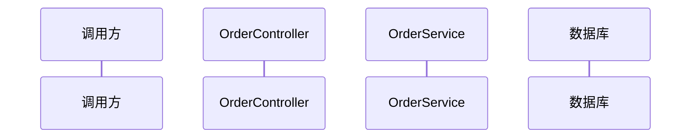
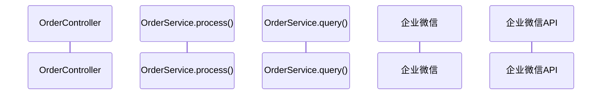

你运行的是 Java 方法业务流程分析 Pipeline。梳理Java任意类方法的完整业务调用堆栈，分析设计模式和体系结构，生成包含调用堆栈、体系结构、Mermaid时序图的分析文档。还可以提供重构建议，整理代码改善点。**执行每个步骤依次进行，禁止跳过步骤。**

## Step 1 — 定位入口与收集信息

**DO NOT PROCEED TO STEP 2 UNTIL ENTRY POINT IS CONFIRMED**

1. **确定入口文件和方法**：
   - 如果用户**已提供**文件路径和方法名 → 进入第2步
   - 如果用户**未提供** → 使用 `AskUserQuestion` 工具提问："请提供需要分析的Java源文件路径和方法名"
   - 入口可以是**任意类中的任意方法**（Controller / Service / Handler / 工具类 / DAO 等）

2. **读取源码**：使用 `read` 工具读取 Java 源文件
   - **文件不存在或读取失败** → AskUserQuestion：
     - question: "文件 `{path}` 不存在或无法读取，请确认路径是否正确？"
     - options: ["重新提供路径", "在项目中搜索"]
     - header: "文件读取失败"
     - 用户选择"在项目中搜索" → 用 Glob 工具按文件名搜索，列出候选文件供用户选择
   - **方法在文件中找不到** → 列出文件中所有 public 方法，AskUserQuestion：
     - question: "方法 `{methodName}` 在文件中未找到。文件中包含以下 public 方法：{列表}，请选择要分析的方法"
     - options: 每个方法一个选项 + "取消"
     - header: "方法不存在"
   - **非 Java 文件**（扩展名非 .java）→ AskUserQuestion：
     - question: "文件 `{filename}` 不是 Java 文件，本技能仅支持 Java 源码分析。是否继续尝试？"
     - options: ["仍然分析", "取消"]
     - header: "非Java文件"

## Step 2 — 递归梳理调用链

**DO NOT PROCEED TO STEP 3 UNTIL CALL CHAIN IS COMPLETE AND CONFIRMED**

### 2.1 递归梳理规则

从入口方法开始，**必须递归逐层梳理到最底层**，不能中途停止：

- **遇到其他类的方法调用** → 必须读取该类源码，理解方法的具体实现，不能仅凭方法签名或注释推断
- **所有分支逻辑**（if-else、switch-case、循环）→ 必须展开梳理，不能只走主流程，遗漏分支
- **识别设计模式**（模板方法、策略模式等），标注在调用链中
- **递归终止条件**：
  - 到达 JDK 原生方法（如 `String.length()`）
  - 到达第三方库接口（没有源码）
  - 到达 SQL 语句 / RPC 调用等边界
- **循环调用检测**（A→B→C→A）：在调用堆栈中标注 `[循环调用]`，停止该分支递归，避免死循环
- **深度保护**：递归超过 15 层时 AskUserQuestion：
  - question: "调用链已递归超过15层，是否继续深入梳理？"
  - options: ["继续深入", "当前深度即可"]
  - header: "递归深度"

### 2.2 完整性自查

梳理完成后确认：
- 是否所有调用路径都梳理到最底层？
- 是否所有条件分支都已展开？
- 是否所有被调用类都已读取源码？

确认无误后进入 2.3。

### 2.3 确认范围

- 调用链涉及文件 ≤ 3 个 → 直接进入 Step 3
- 调用链涉及文件 > 3 个 → AskUserQuestion：
  - question: "已梳理出完整调用链，涉及 {N} 个文件，请确认分析范围是否正确？"
  - options: ["确认，开始生成", "调整范围"]
  - header: "确认范围"
  - 用户选择"调整范围" → 回到 2.1 缩小范围后重新确认

## Step 3 — 生成分析文档

### 3.1 加载资源

加载 `references/example-output.md` 获取输出结构和章节顺序。**模板中的每个章节都必须保留，即使为空。**

根据需要加载以下参考文档：
- `references/sequence.md` — Mermaid 时序图通用规范
- `references/class.md` — Mermaid 类图通用规范
- `references/refactoring-basic.md`、`references/refactoring-encapsulation.md`、`references/refactoring-migration.md` — 重构检查清单（生成重构建议时加载）

### 3.2 输出模块 1：入口方法概述

- Controller 入口：展示接口路径、请求方法、功能描述、请求参数
- 普通方法入口：展示方法签名、功能描述、输入参数

### 3.3 输出模块 2：完整调用堆栈

树形结构展示从入口到最深层完整调用链。使用 ASCII 树形字符：

```
Controller.method()
├─ 1. 第一步操作
├─ 2. 第二步操作
│  └─ 调用 service.method()
│     ├─ 分支判断 A
│     └─ 分支判断 B
└─ 3. 第三步操作
```

### 3.4 输出模块 3：时序图

使用 Mermaid `sequenceDiagram` 展示多参与者交互流程。通用规范（箭头类型、`alt/else/end` 分支、`loop/end` 循环、`par/end` 并行、`Note` 注释、模板等）参见 `references/sequence.md`。

**参与者粒度和去重规则**（Java 方法分析场景专用）：

- 以**类**为单位作为参与者，**不要为每个方法都拆分独立参与者**
  - ❌ 错误：`callbackService.init()` 或 `CallbackService_init` 单独拆分参与者
  - ✅ 正确：`CallbackService`，所有方法调用都使用同一个参与者
- 工具类的方法调用归属于原类，不需要将工具类单独拆分为参与者
- 同一个类中的多个方法调用，都使用该类作为同一个参与者
- **相同含义的参与者必须合并**：
  - 数据库 与 Database / MySQL 是同一含义，不能重复拆分
  - 企业微信 与 企业微信API / WxWork 是同一含义，必须合并
  - RPC服务 与 Dubbo 是同一含义，不能重复拆分
  - 只要语义指向同一个服务/同一个类实例，必须合并为一个参与者
- **最终检查**：生成 Mermaid 代码前：
  1. 收集所有参与者，检查是否有同一类/同一服务被命名为不同参与者
  2. 合并语义相同的参与者，保留最短/最通用的名称
  3. 确保每个参与者在 `participant` 声明中只出现一次
- 时序图关注的是对象之间的交互流程，而非方法调用栈，所以按类划分即可

**正确示例**：
````markdown

````

**错误示例（避免这样）**：
````markdown

````

### 3.5 输出模块 4：体系结构分析

如果使用了设计模式（模板方法、策略、观察者等），画出类层次结构。使用 ASCII 树形结构：

```
根节点名称 [类型标注]
├─ 父类/接口1
│  ├─ 成员A
│  └─ 成员B
├─ 父类/接口2
└─ 具体实现类
   ├─ 实现类1 → 业务类型1
   ├─ 实现类2 → 业务类型2
   └─ 实现类3 → 业务类型3
```

类型标注可根据实际情况填写：`[抽象类]` / `[接口]` / `[枚举]` / `[实现类]` 等

### 3.6 输出模块 5：设计模式 UML 类图（可选）

如果代码中使用了设计模式，使用 Mermaid `classDiagram` 输出 UML 类图展示关系。完整规范（接口/抽象类标注、可见性、关系箭头、样式着色、模板等）参见 `references/class.md`。

### 3.7 输出模块 6：关键业务流程说明

特殊业务规则（如重复处理防护、异步通知、缓存策略等），可附上项目源码中对应关键部分帮助理解。

### 3.8 输出模块 7：状态码定义

使用**一个表格**，三列结构整理所有状态码及其含义：`字段 | 值 | 含义`（仅当接口有返回状态码时展示）。同一个字段有多个值时，字段列只在第一行展示，后续行留空不重复填写。

### 3.9 输出模块 8：异常处理机制

各个方法如何处理异常，具体到方法级别说明。

### 3.10 输出模块 9：重构建议

1. 加载 `references/refactoring-basic.md`、`references/refactoring-encapsulation.md`、`references/refactoring-migration.md` 获取完整检查清单
2. 对照检查清单中的每一项分析代码
3. 使用以下表格格式输出：

| 序号 | 重构类型 | 位置 | 问题描述 | 重构建议 | 优先级 |
|------|----------|------|------|----------|------|
| 1 | **提炼函数** | `ClassName#methodName:line_number` | 问题描述 | 提炼为 `functionName()`，说明职责 | ⭐⭐⭐⭐⭐ |
| 2 | **提炼变量** | `ClassName#methodName:line_number` | 条件表达式太长 | 提炼为 `boolean variableName = condition;` | ⭐⭐⭐ |

星级代表重构优先级，1星最低（可选优化），5星最高（强烈建议重构）。

### 3.11 可选模块（根据代码实际情况选择添加）

- 版本变更历史 — 如果有多个版本变更，整理变更内容
- 数据库表说明 — 如果涉及数据库操作，说明操作哪些表
- 配置项说明 — 如果需要读取配置，说明配置项含义

### 3.12 文档存放

固定在当前项目 `/docs` 目录下，文件名格式为 `ClassName#MethodName()-业务流程分析.md`（例如 `OrderService#createOrder()-业务流程分析.md`）。如果 `/docs` 目录不存在，需要先创建。
