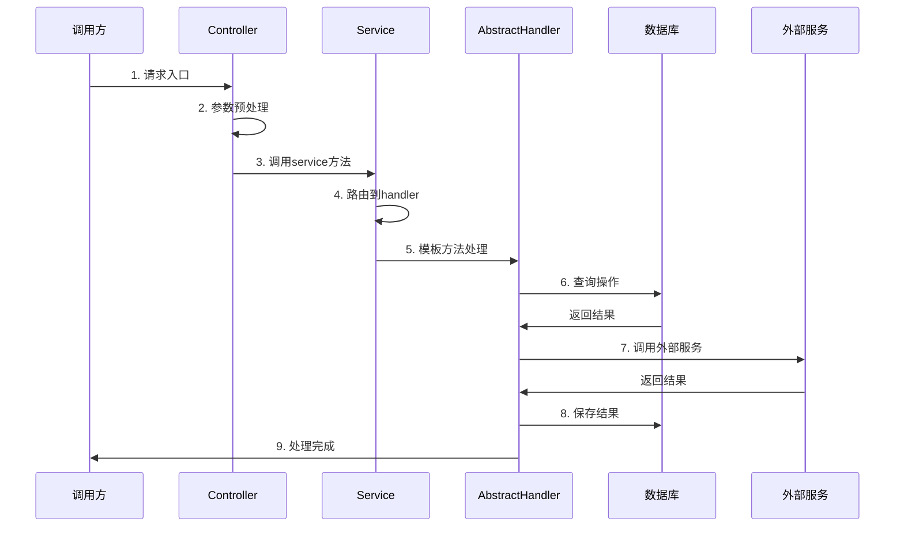
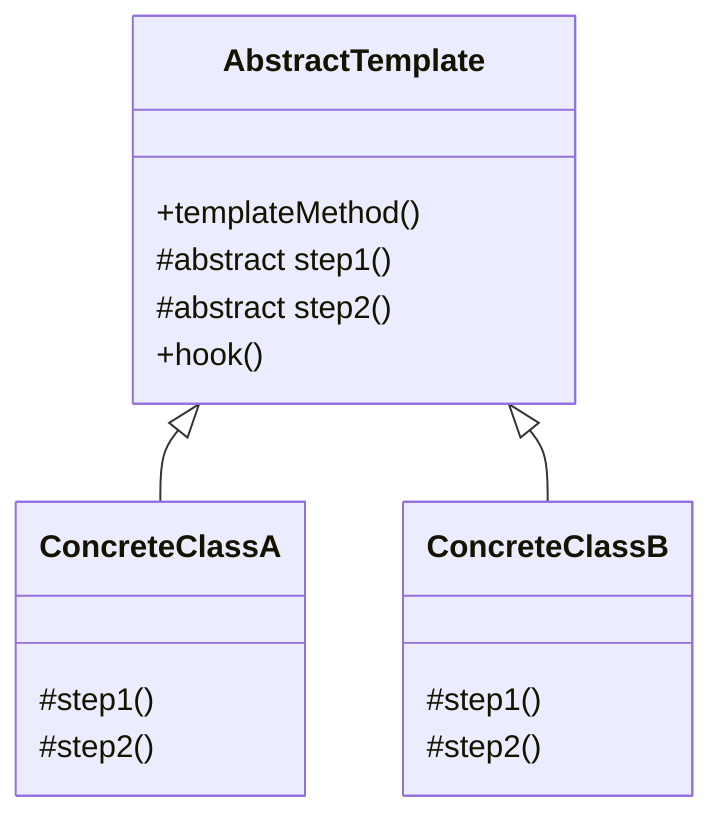
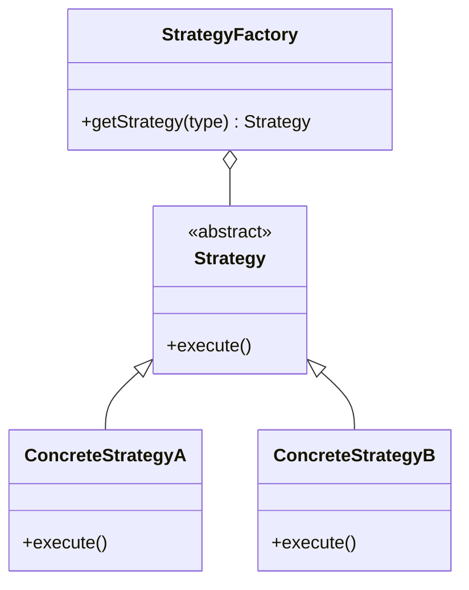

# 示例输出：X.X.X 功能业务分析文档

## 目录

- [一、入口方法概述](#一入口方法概述)
- [二、完整调用堆栈](#二完整调用堆栈)
- [三、时序图](#三时序图)
- [四、体系结构分析](#四体系结构分析)
- [五、设计模式分析](#五设计模式-analysis) *（可选，有设计模式才展示）*
- [六、关键业务流程说明](#六关键业务流程说明)
- [七、状态码定义](#七状态码定义)
- [八、异常处理机制](#八异常处理机制)
- [九、重构建议](#九重构建议) *（可选，用户要求才生成）*

---

## 一、入口方法概述（Controller 入口示例）

### 1.1 接口信息

| 项 | 值 |
|----|-----|
| **请求路径** | `POST /path/to/endpoint` |
| **入口方法** | `Controller.method(Type param)` |
| **功能描述** | 简要描述这个接口做什么 |
| **调用方** | 谁调用这个接口 |

### 1.2 请求参数

- **URL参数**:
  - `param1` - 描述
  - `param2` - 描述

- **Body**: 描述body内容

---

## 一、入口方法概述（普通方法入口示例）

### 1.1 方法信息

| 项 | 值 |
|----|-----|
| **类名** | `com.example.ServiceClassName` |
| **方法名** | `methodName(Type param1, Type param2)` |
| **功能描述** | 简要描述这个方法做什么 |
| **调用场景** | 哪里会调用这个方法 |

---

## 二、完整调用堆栈

```
Controller.method(Type param) [POST /path]
├─ 1. 第一步操作
├─ 2. 第二步操作
│   ├─ 分支 A
│   └─ 分支 B
│       └─ 调用 service.otherMethod()
│           ├─ 操作1
│           └─ 操作2
└─ 3. 第三步操作
```

---

## 三、时序图 *（Mermaid 格式）*



---

## 四、体系结构分析

### 4.1 类层次结构

```
AbstractRoot [抽象类]
├─ 抽象方法（子类必须实现）
│  ├─ method1()
│  └─ method2()
├─ 可重写方法（默认提供通用实现）
│  └─ method3()
├─ 公共方法（所有子类共享）
│  ├─ commonMethod1()
│  └─ commonMethod2()
└─ 具体实现子类
   ├─ SubClass1 → TYPE_1 业务类型1
   ├─ SubClass2 → TYPE_2 业务类型2
   └─ SubClass3 → TYPE_3 业务类型3
```

---

## 五、设计模式分析 *（可选，有设计模式才展示）*

### 5.1 模板方法模式

**使用场景**: 抽象类定义完整处理骨架，差异化步骤交给子类实现。

**优点**:
- 遵循开闭原则，新增类型只需新增子类
- 公共逻辑抽取到父类，代码复用

**UML类图**:


### 5.2 策略模式 + 工厂模式

**使用场景**: 根据类型参数路由到不同处理器。

**优点**:
- 运行时动态选择
- 新增类型不影响原有代码

**UML类图**:


---

## 六、关键业务流程说明

### 6.1 XXX 特殊处理

描述特殊业务规则...

对应项目代码片段（`com.example.Service#method`）：
```java
// 这是对应处理代码
if (condition) {
    // 特殊业务处理
    doSomething();
}
```

### 6.2 YYY 缓存策略

描述缓存...

---

## 七、状态码定义

| 字段 | 值 | 含义 |
|------|-----|------|
| status | 0 | 成功 |
|  | 1 | 系统错误 |
|  | 2 | 参数错误 |
|  | 3 | 业务异常 |
|  | 4 | 未授权 |
| gender | male | 男性 |
|  | female | 女性 |

---

## 八、异常处理机制

| 方法 | 处理方式 |
|------|----------|
| **Controller.method()** | try-catch全局包裹，记录异常日志，返回封装错误结果 |
| **Service.doBusiness()** | 业务校验失败抛出BusinessException，上层统一处理 |
| **Handler.process()** | 验证失败直接返回错误码，不抛出异常 |

---

 ## 九、重构建议 *（可选）*

 | 序号 | 重构类型 | 位置 | 问题描述 | 重构建议 | 优先级 |
 |------|----------|------|------|----------|------|
 | 1 | **提炼函数** | `ClassName.methodName()` 行 `N~M` | 问题描述 | 提炼为 `functionName()`，说明职责 | ⭐⭐⭐⭐⭐ (5星最高优先级必须改) |
 | 2 | **提炼变量** | `ClassName.methodName()` 行 `N` | 条件表达式太长 | 提炼为 `boolean variableName = condition;` | ⭐⭐⭐ (3星中等优先级) |

 *星级代表重构优先级，1星最低（可选优化），5星最高（强烈建议重构）*
